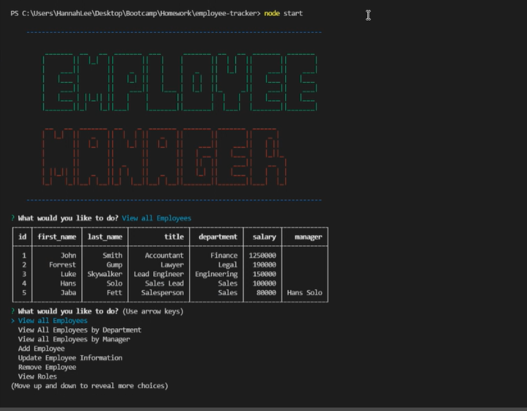
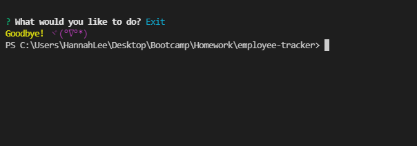

# Employee Tracker

Need a way to organize your employees, their roles, and departments? Then try out this application for your organization! It's easy, simple, and straight-forward for any user. 

## Description 
This application can tracks:
- employees
- roles
- departments

### Step 1: Seed Your Database
 

 You will need a database to start up your application. The database will need roles, departments, and employees. Dummy data has been provided for you. 

 ### Step 2: Start Up The Terminal

 In order to use the application, be sure to open up your terminal and type in 'node start' to begin the application.

 

 You will then be presented with a screen portraying all of your options. Using the arrow keys, scroll through them to select which option you would like to explore and use. When you are happy with your selection, press Enter to select.

 There are many things you can do with this application! Please check out the features list below to see everything this application can offer you! You may also check out this link to see a short video on how each option works: 

https://drive.google.com/file/d/104zOacTPB87V6oSe2TcaDeMeVIvTNQIp/view

Once you are done with your application, you can close out by clicking the Exit option.

 ## Features
User can view
- Employees, their ids, their managers, their roles, their salaries, and their departments
- Sort and view employees by department or by manager
- Roles, salaries of that role, role's department and role ids
- Departments and their ids
- Total utilized budget by department
- If there is no information, the application will let the user know

User can update employee's
- First name
- Last name
- Manager
- Role

User can remove
- An employee
- A role
- A department
- If that role or department is in use by an employee, the application will let the user know and prevent the user from deleting that role/department. 

